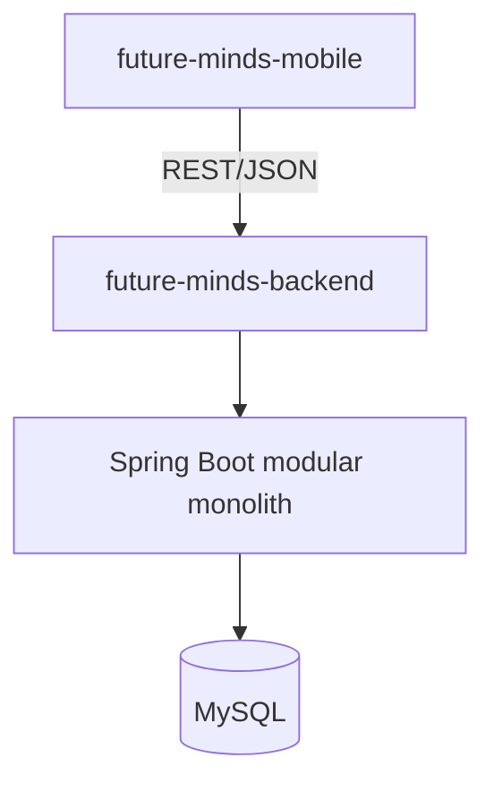

# Backend Architecture — Foundation Decisions

Status: Approved
Phase: 3 — Spring Boot Backend Foundation
Part: 51 — Architecture Foundation

This document records the architecture decisions approved for `future-minds-backend`.
It is a decision record, not an implementation. No Spring Boot project, build files,
source code, dependencies, database configuration, APIs, entities, or business logic
exist yet as a result of this document.

## 1. Repository

- Dedicated Git repository: `future-minds-backend`.
- Kept separate from `future-minds-mobile`.
- No monorepo for the MVP.

## 2. Backend technology

- Language: Java.
- Java 21 LTS, unless repository inspection identifies a concrete blocker.
- Framework: Spring Boot.
- Build tool: Maven, unless repository inspection identifies a concrete blocker.

## 3. Architecture style

- Modular monolith.
- Single deployable Spring Boot application.
- No microservices for the MVP.

## 4. Database

- MySQL.
- Flyway for schema migrations.
- Credentials supplied through environment-specific configuration, never checked in.

## 5. Package root

```
au.com.futureminds.learning
```

## 6. Logical modules

The following are the conceptual modular-monolith boundaries:

- identity
- family
- entitlement
- content
- assessment
- diagnosis
- reporting
- practice
- administration
- payments
- notifications
- analytics

These are conceptual boundaries only. Packages for a given module are created when
that module is implemented, not all at once.

## 7. Preferred feature-module layout (when a module is implemented)

```
<module>/
  api/
  application/
  domain/
  infrastructure/
```

## 8. API conventions

- REST/JSON.
- Base path: `/api/v1`.
- OpenAPI documentation added later.
- Request validation with Jakarta Bean Validation.
- Consistent Problem Details–style error handling.
- Workflow decisions are server-authoritative.

## 9. Configuration

- `application.properties` (base configuration).
- `application-local.properties` (local development).
- `application-test.properties` (test execution).
- `application-prod.properties` (production).
- Active profile is selected externally via the `SPRING_PROFILES_ACTIVE`
  environment variable (`local`, `test`, or `prod`); it is never hard-coded
  in `application.properties`.
- Secrets supplied via environment variables.
- Production configuration must never contain checked-in credentials.

## 10. Database migrations

Location:

```
src/main/resources/db/migration
```

## 11. Testing strategy

- Plain unit tests for deterministic rules.
- Spring slice tests where appropriate.
- Integration tests.
- MySQL-compatible integration testing.
- Architecture tests considered, to enforce module boundaries.

## 12. Architecture principles

- Diagnostic rules are deterministic.
- Outcomes are versioned and reproducible.
- LLMs have no authority over scoring, mastery, diagnostic classification,
  misconception confirmation, or progression.
- Workflow state is server-authoritative.
- State transitions are transactional.
- Writes are idempotent where retries are possible.
- Child data collected and retained is minimal.
- External provider integrations sit behind interfaces.
- Synthetic test data is used by default.
- Code is organised package-by-feature.

## 13. Explicit non-goals for PART 51

This document does not cover, and no related implementation exists yet, for:

- authentication
- parent/student persistence
- diagnostic engine
- assessment engine
- subscriptions
- payments
- practice/reassessment
- question bank
- reporting
- notifications
- analytics implementation
- mobile/backend integration

## 14. Architecture diagram



## 15. Phase 3 progression

- **PART 51** — Architecture foundation *(this document)*
- **PART 52** — Spring Boot skeleton
- **PART 53** — Configuration, MySQL and migration foundation
- **PART 54** — API conventions and backend technical baseline
